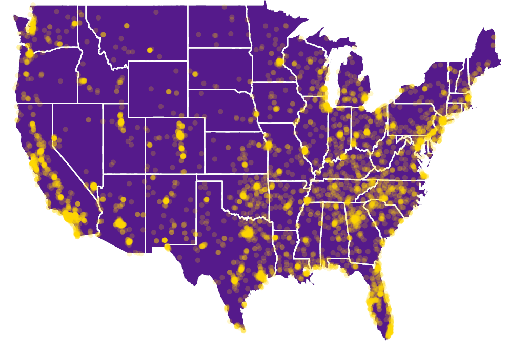
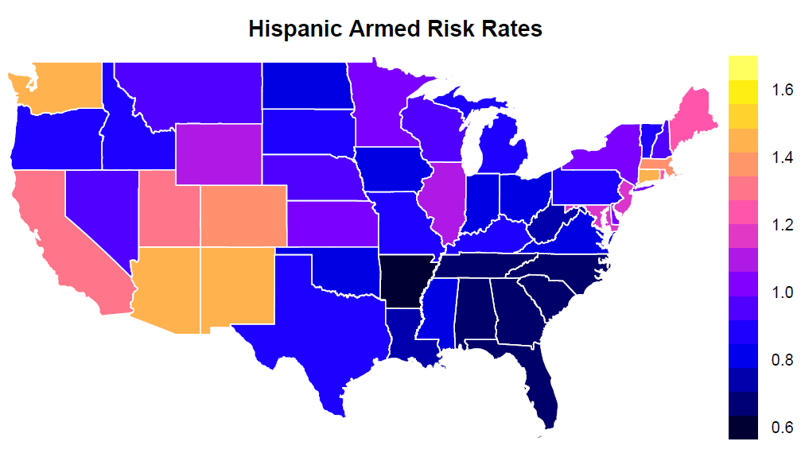
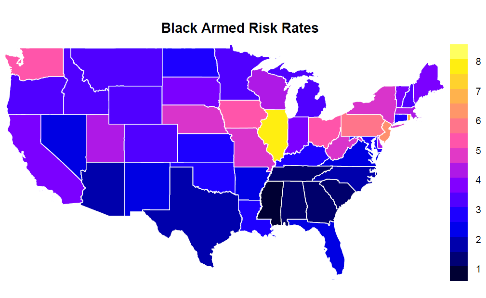
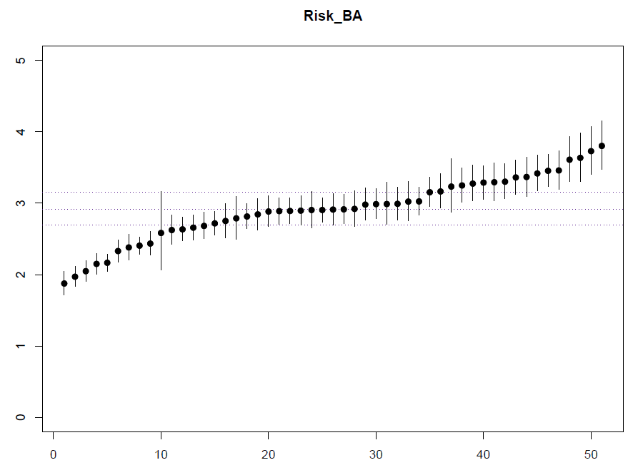
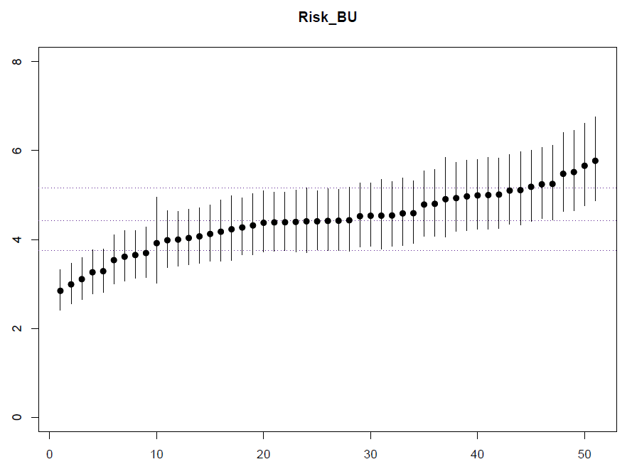
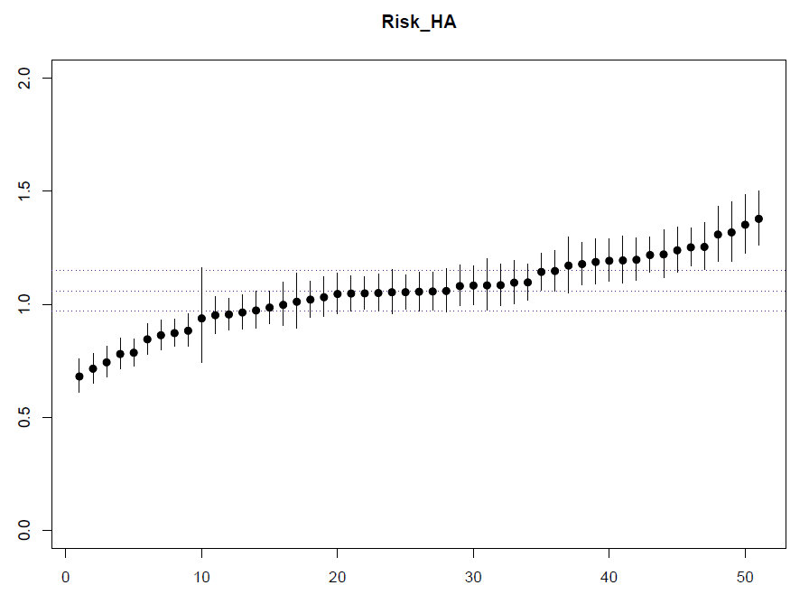
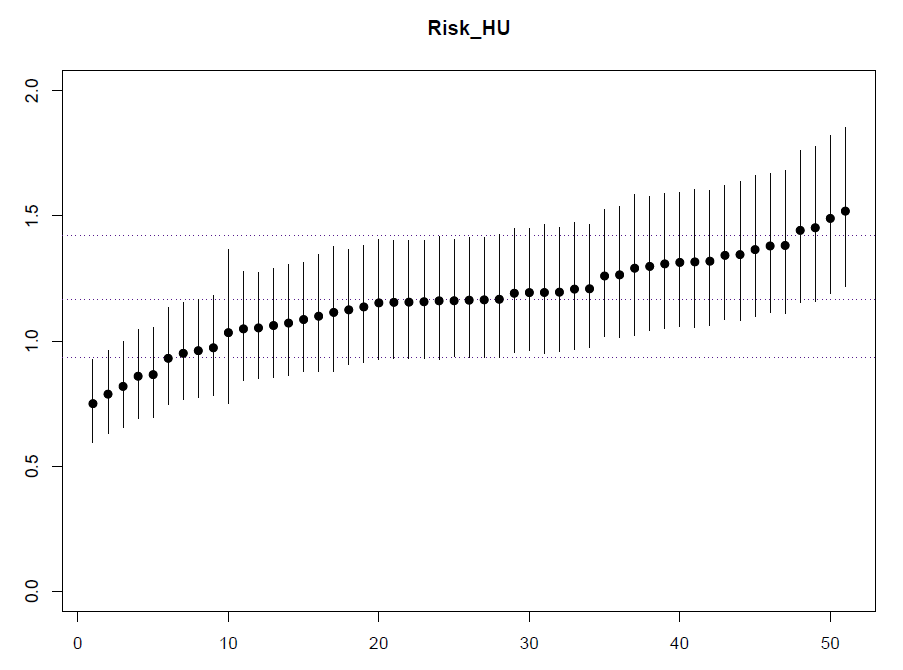

# Bayesian Analysis of Police Brutality in the U.S.
Project for Bayesian Statistics course @polimi 2020/2021

Francesco Giammaria, Matteo S. Savino, Iacopo Zinno

### Structure of the folders
* report: contains the project report
* *R SCRIPT*: contains all the R scripts
  * *DATA*: contains all the used data (some of them must be unzipped)
  * *STAN_MODELS* contains the script of the models used in STAN 
  * *maps*: contains shapefiles useful for plotting
* *img*: contains images for the readme

## Introduction
With this project we want to study the phenomenon of the police brutality in the U.S. and in particular if there is a racial bias in the actions of the police. 
In particular we have focused our work on the study of the risks associated with being an Afro-American people or an Hispanic one distinguish also the case of an armed people and an unarmed one.

This is a plot of the killings all over the U.S across the six years (2015-2020) that we have taken in count for our analysis

## Results
We can say that is actually present a racial bias against the Afro-Americans people in all the U.S. while for the Hispanic ones is not a so widespread phenomenon, but it is more restricted to some specific states. 

Here there are some plots of the results we have obtained, where 'R' is the so called 'Risk Rate' of being shot given a certain ethnicity and condition during the arrest (armed or unarmed):

For a more thoroughly discussion, more plots and all the references, please refer to the project report.
